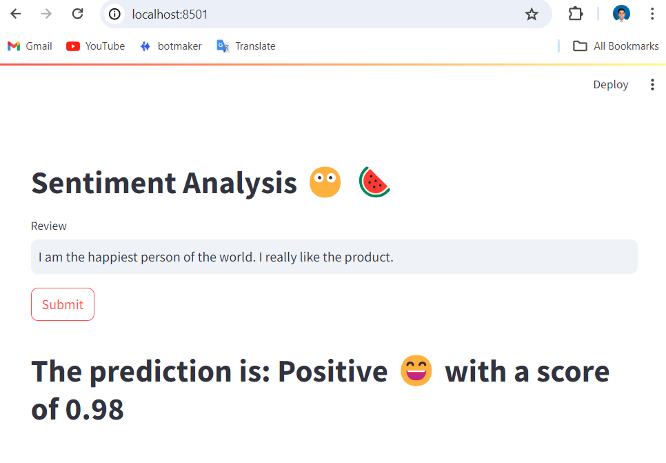
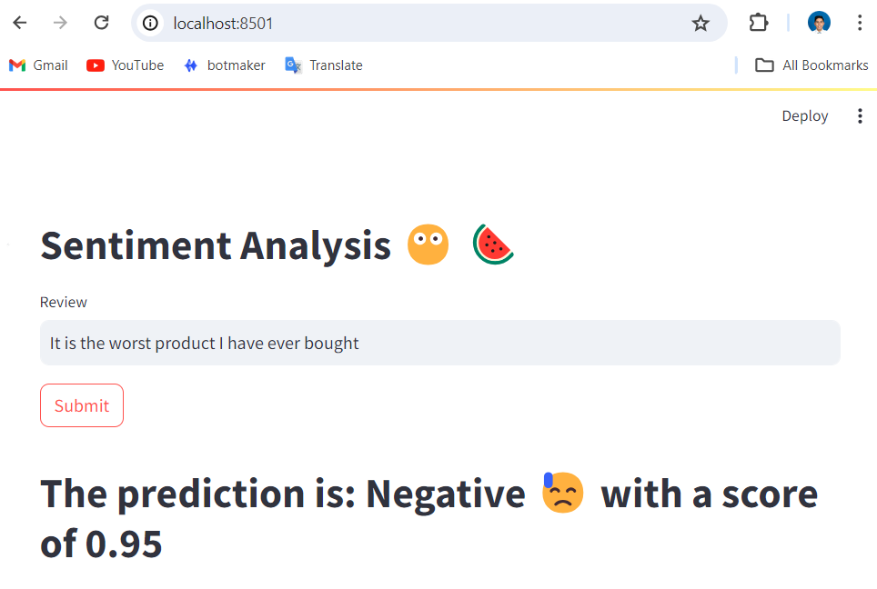
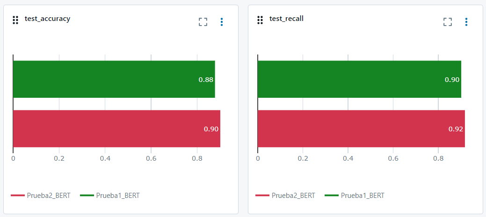
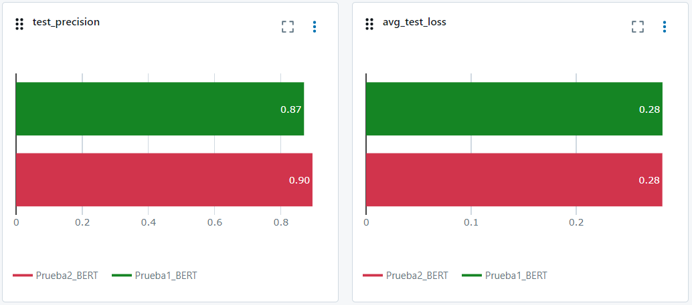
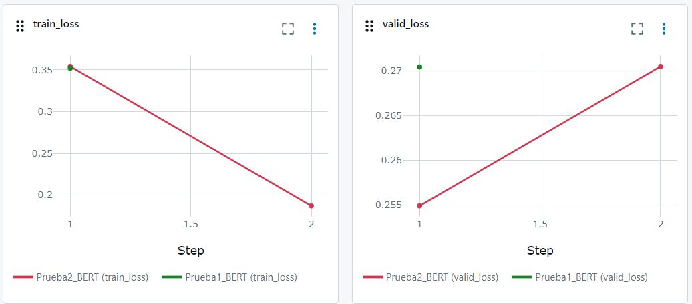
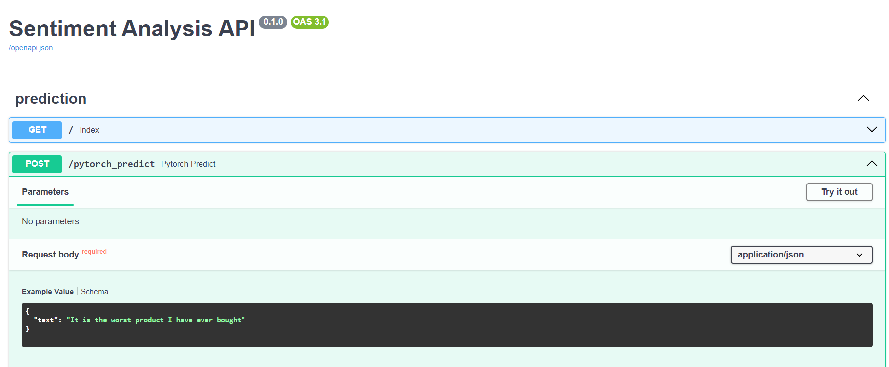
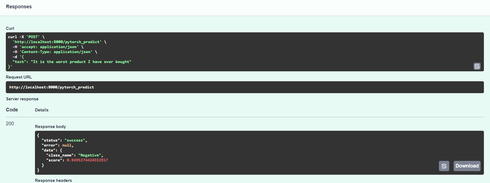

# Sentiment Analysis for Amazon Reviews

This project focuses on developing and evaluating an API for sentiment analysis specifically tailored for Amazon reviews. Our goal is to compare the performance of various fine-tuning configurations of the BERT model. The project leverages several key technologies and libraries, including PyTorch, MLflow, Hugging Face Transformers, NLTK, and Scikit-learn.

### Key Features:

- **Sentiment Analysis API:** A robust API capable of analyzing the sentiment of Amazon reviews, providing insights into customer opinions.
- **BERT Model Fine-Tuning:** Exploration of different fine-tuning strategies for the BERT model to optimize sentiment analysis performance.
- **Comprehensive Evaluation:** Detailed comparison of various configurations to determine the most effective approach.
- **Technology Stack:**
  - **PyTorch:** For model implementation and training.
  - **MLflow:** For experiment tracking and model management.
  - **Transformers:** Utilizing Hugging Face's library for state-of-the-art NLP models.
  - **NLTK:** For text preprocessing and analysis.
  - **Scikit-learn:** For additional machine learning utilities and evaluation metrics.

## Streamlit frontend

**Positive example**

**Negative example**

## Comparison of Model Performance

Here, we present the overall accuracy, precision, recall, train loss and valid loss achieved by each model.

## FastAPI for Sentiment Analysis

The API provides a POST endpoint for sentiment analysis using PyTorch.

